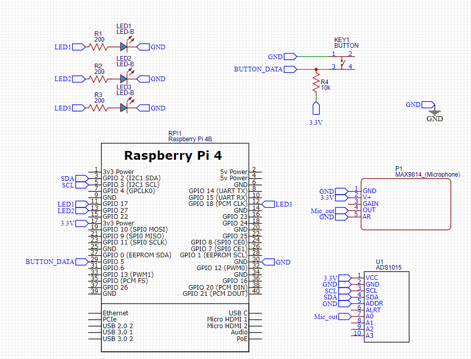
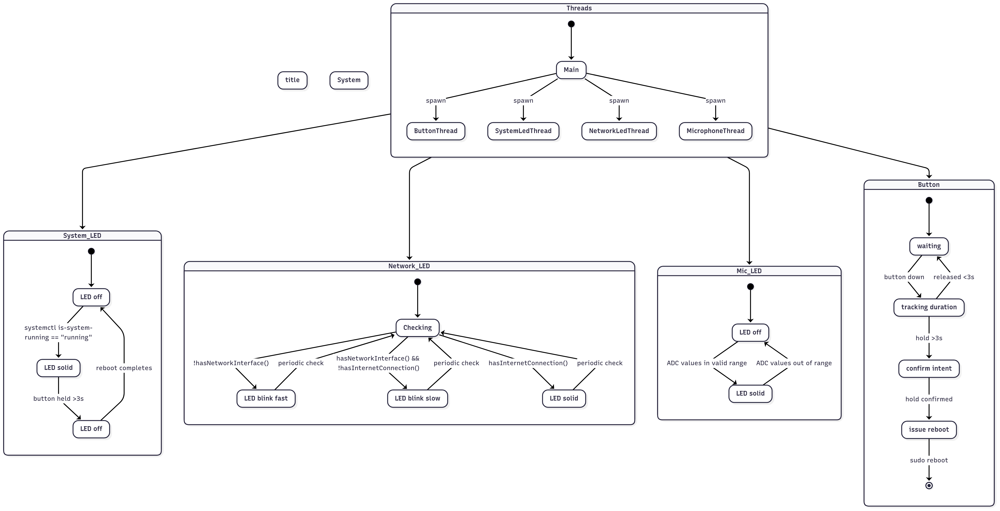

# sbc-control-panel

## Project structure

```text
sbc-control-panel/
├── assets/
│   ├── schematic.png
│   └── state_diagram.png
├── include/
│   ├── GpioPin.hpp
│   ├── ZmqService.hpp
│   ├── LedController.hpp
│   ├── Logger.hpp
│   ├── NetworkMonitor.hpp
│   ├── ButtonWatcher.hpp
│   ├── MicrophoneMonitor.hpp
│   └── StateTypes.hpp
├── src/
│   ├── main.cpp
│   ├── GpioPin.cpp
│   ├── ZmqService.cpp
│   ├── LedController.cpp
│   ├── Logger.cpp
│   ├── NetworkMonitor.cpp
│   ├── ButtonWatcher.cpp
│   └── MicrophoneMonitor.cpp
├── CMakeLists.txt
├── build.sh
├── install_dependencies.sh
├── install_sudoers.sh
├── setup_systemd.sh
├── sbc_cp.service
├── README.md
└── .gitignore
```

## Schematic



## State Diagram

You can view the full state diagram (LED & button control logic) here:

[Open Mermaid state diagram](https://www.mermaidchart.com/app/projects/dd48604f-f231-4d96-9801-e5d4dd8abb1a/diagrams/975d63b3-530b-47d8-b501-1a85a7f480c2/version/v0.1/edit)



## Installing Dependencies

To build and run this project on Raspberry Pi (tested on Raspberry Pi 4), you need the following dependencies:

- `g++` (C++17 compiler)
- `cmake` (build system)
- `pkg-config` (library helper)
- `libzmq3-dev` (ZeroMQ)
- [`wiringPi`](http://wiringpi.com/) (GPIO control — manually installed)

You can install most of them with the script below:

```
./install_dependencies.sh
```

The wiringPi library is no longer maintained in APT and must be installed manually. To do this:

```
cd ~
git clone https://github.com/WiringPi/WiringPi.git
cd WiringPi
./build
```

## Using the Control Panel

To use the control panel, follow these steps on your Raspberry Pi (tested on Raspberry Pi 4):

### 1. Install Dependencies

Before anything else, install required packages using the provided script:

```bash
./install_dependencies.sh
```

> Note: `wiringPi` is no longer available via APT. 

### 2. Configure Sudoers

To allow the system to execute shutdown and reboot commands without prompting for a password, run:

```bash
./install_sudoers.sh
```

This script appends a `NOPASSWD` rule for the control panel to the `/etc/sudoers.d/` directory.

### 3. Build the Project

Compile the code using the build script:

```bash
./build.sh
```

This script creates a fresh `build/` directory, runs CMake, and builds the control panel executable.

### 4. Install systemd Service

Set up the control panel to run automatically on boot with:

```bash
./setup_systemd.sh
```

This script will:

- Copy `sbc_cp.service` to `/etc/systemd/system/`
- Reload the systemd daemon
- Enable the service on boot
- Start the service immediately


### 5. Run the Application

If you want to run it manually (e.g., for debugging), use:

```bash
./build/control_panel
```

You can also filter logs, for example, to see only button-related messages:

```bash
./build/control_panel | grep "\[ButtonWatcher\]"
```

Once systemd is set up, the control panel will launch automatically on each system startup.
